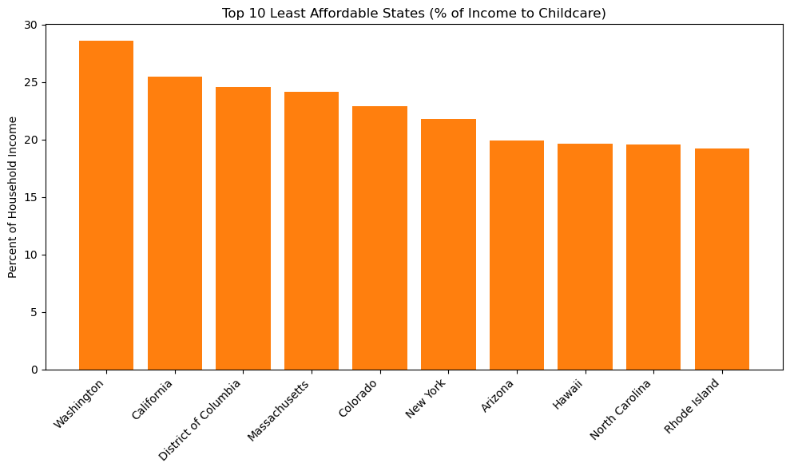
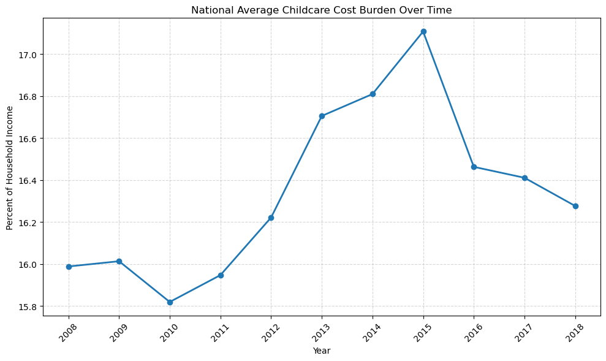

# Childcare Affordability Analysis

How much of their household income do U.S. families spend on childcare? This project uses the National Database of Childcare Prices to measure the cost burden of center-based care for children from birth to age 5, across states and counties and over time.

## Key Findings

- **Every state exceeds the federal affordability benchmark of 7% of household income.**
- **Washington is the least affordable state**, with families spending an average of 28.6% of household income, followed by California (25.5%), the District of Columbia (24.6%), and Massachusetts (24.2%).
- **South Dakota is the most affordable** at 11.3%, followed by Kansas (11.6%) and Mississippi (11.9%).
- Across all counties and years, the average is about 16% of household income.



## Data

[National Database of Childcare Prices](https://www.dol.gov/agencies/wb/topics/featured-childcare) (U.S. Department of Labor, Women's Bureau): county-level childcare prices and household demographics, 2008 to 2018.

Two fields drive the analysis:

- `MCBto5`: median weekly price of center-based care for children from birth to age 5
- `MHI`: median household income

## Method

1. Kept the state, county, year, price, and income fields, and dropped rows missing price or income.
2. Confirmed in the dataset's technical guide that prices are weekly, then annualized them by multiplying by 52.
3. Calculated the cost burden: `(weekly price × 52) / median household income × 100`.
4. Checked for extreme outliers. The maximum was 54.3%, which is high but realistic, so no rows were removed.
5. Averaged across counties to rank states, and across years to track the national trend.



## Visualizations

- Top 10 least and most affordable states
- U.S. map of affordability by state
- National trend over time
- Most expensive counties within a state (California)
- State versus national trend

## Limitations

- The dataset does not make clear whether prices reflect full-time or part-time care.
- State figures are simple averages across counties, so they are not weighted by population.
- Differences between urban and rural counties are not explored here.

## How to Run

1. Download the National Database of Childcare Prices Excel file from the link above, and save it in the same folder as the notebook as `nationaldatabaseofchildcareprices.xlsx`.
2. Install the required libraries:
```
   pip install pandas openpyxl matplotlib plotly
```
3. Open `childcare_affordability_analysis.ipynb` in Jupyter Notebook and run all cells.

## Files

- `childcare_affordability_analysis.ipynb`: data preparation, affordability calculation, and charts
- `images/`: charts shown in this README

## Tools

Python, pandas, Matplotlib, Plotly
